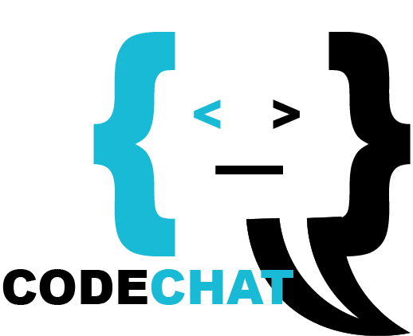

# Webstack - Portfolio Project
Final portfolio project for alx software engineering program. our project is codechat a real-time web based chat app.

## CODECHAT - Real-time web based chat app

## CODECHAT:  is web based real-time chat application built using React.js and firebase. 
### - Feature: Real-time messaging, user authentication and more..
### - Aim: To create chatting environment for programmer
### - Goal: Satisfying users with our service

## Project Scope
### - Single-chat application for real-time communication.
### - User-friendly interface with a focus on simplicity.

## Why we choose those technology?

### - React for its component-based architecture and Performance.
### - SCSS for styling and maintaining code.
### - Firebase for real-time features and easy authentication.

# Authors
### Akrem Beker - [Github](https://github.com/Abualiy), [Email](akremmuktar332@gmail.com)
### Neima Nesru - [Github](https://github.com/Nemuuuu), [Email](neimanesru34@gmail.com)

